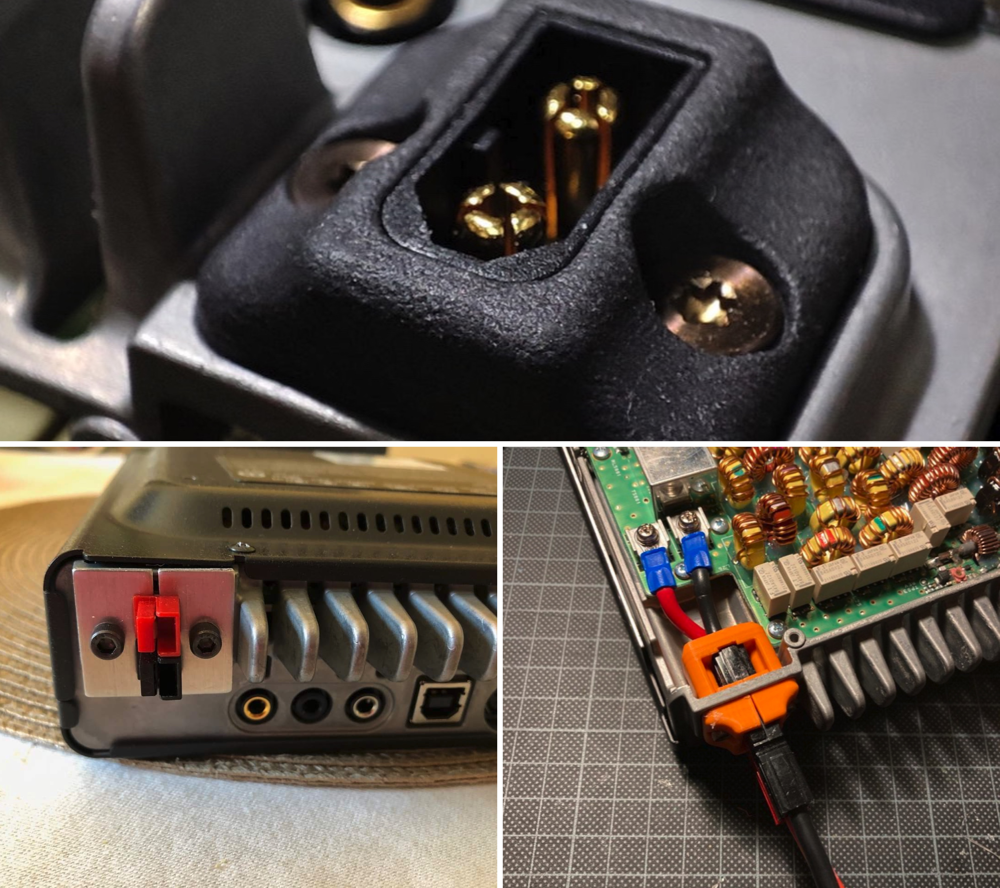
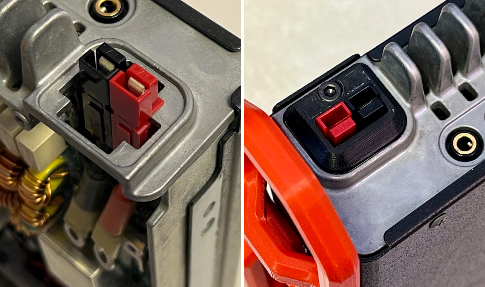

# FT891 Power Connector Conversion
#### -- A solution to convert Molex power connector to PowerPole
-------

## DESIGN INSPIRATION

TL; DR 

Save 2min reading and jump into HOW-TO section.

-------
Yaesu FT-891 is a well designed 100W HF radio beloved by portable HAM operators for POTA/SOTA/field Op. Its factory 4-pin Molex connector helps to secure the power cord with an interlock, however, it leaks of quick-release for fast deployment and suffers from reduced durability after long-term plugging/unpluging.

A [FT-891 XT60 Power Connector](https://www.thingiverse.com/thing:5322052) designed by [BH4DMQ](https://www.qrz.com/db/BH4DMQ) (Fig.1a) provides insight on how to replace Molex with other quick-release enabled power connectors, and inspired me to start this project.

| |
|:--:|
|*Fig.1  a) BH4DMQ's XT60, b) N2FQ's "bare metal", 3) DG7PX's 3d printed parts*|

Instead of XT60, I choose to replace the Molex with Powerpole, a commonly used connector by HAM for field operation and emergency communication. 

My early version was a direct adoption of BH4DMQ's idea, which puts the powerpole vertically and holds everything in place entirely by a 3d-printed plate, which is similar to [N2FQ](https://www.qrz.com/db/N2FQ)'s "bare metal" (Fig.1b), or [DG7PX](https://www.qrz.com/db/DG7PX)'s [3d printed parts](https://www.thingiverse.com/thing:5443777) (Fig.1c). 

But after several iterations of design and validation, the powerpole proved to be better inserted horizontally. So I redesigned everything from scratch and got the current version.

In such orientation, 
1) the powerpole can flawlessly slide into the Molex opening (Fig. 2a); 
2) More ergonomic to plug/unplug power cord; 
3) Moreover, plugging/unplugging strength relieves from 3d-printed holding plate to the radio chassis (Fig. 2b).

| |
|:--:|
|*Fig.2  a) Powerpole fit into chassis slot, b) Plate installed finish look,*|

## HOW-TO?

1. 3d printed plate
2. Wire harness
3. Molex replacement

(Under construction, check back later 🚧👨🏻‍💻)
